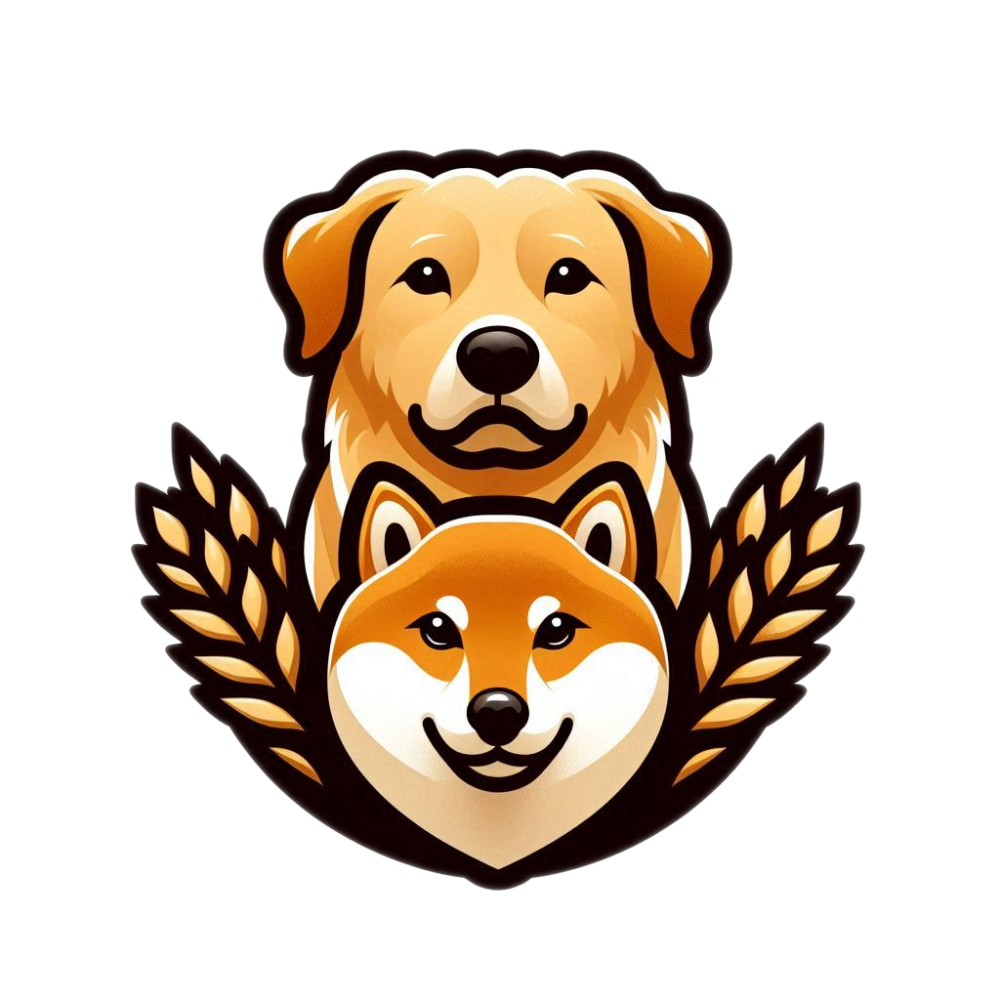
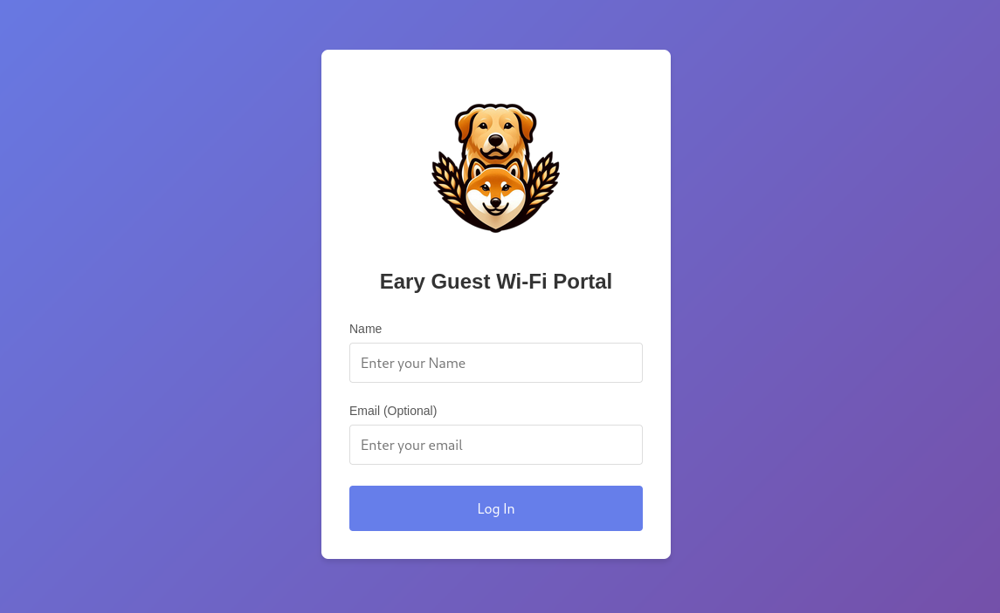

# Unifi Guest Portal

The Unifi Guest Portal is a self-hosted web application designed for managing guest Wi-Fi access. The application consists of a Go-based backend and a Node.js frontend. It provides user-friendly workflows for guest authorization and integrates seamlessly with Unifi networks.


## Features

- **Guest Authorization**: Facilitates guest access to Unifi Wi-Fi networks.
- **Frontend Customization**: Replace logos and update branding.
- **Cache Management**: Automatically manages cache to ensure optimal performance.
- **Dockerized Deployment**: Easy to package and run in containerized environments.

## Example


## Prerequisites

- **Backend**: Requires [Go](https://golang.org/) 1.23.2 or later (earlier versions may work).
- **Frontend**: Requires [Node.js](https://nodejs.org/) 22+ and npm (earlier versions may work).
- **Containerization**: Requires [Podman](https://podman.io/) or Docker for building and running containers. The instructions are written for a Linux installation.

## Installation

1. Clone the repository:
   ```bash
   git clone https://github.com/your-repo/unifi-guest-portal.git
   cd unifi-guest-portalc
   ```
2. Create a `.env` file in the root directory. Refer to the `backend/config` package documentation for the required variables.

## Building the Application
To build both the backend and frontend, run:
   ```bash
   make all
   ```
This will:
- Compile the Go backend.
- Build the Node.js frontend.
- Package everything into the dist/ directory.

To clean up previous builds, use:
   ```bash
   make clean
   ```

## Customizing the Frontend Logos
You can change the logos and other assets in the frontend by replacing files in the `frontend/public` directory:
1. Replace the logo files:
    - Default logo: frontend/public/logo.png
    - Favicon: frontend/public/favicon.ico
2. Rebuild the frontend to apply the changes:
    ```bash
   make build-frontend
   ```

## Running the Application as a Container
1. Build the container image:
    ```bash
   make build-container
   ```
2. Run the container:
   ```bash
   podman run -d --name unifi-guest-portal \
   -p 8080:8080 \
   -v ./dist:/app/dist:Z \
   --env-file .env \
   unifi-guest-portal:latest
   ```
3. Alternatively, setup a `guest-portal` account and utilize the [unifi-guest-portal.container](./unifi-guest-portal.container) in combination with [Podman Quadlet](https://docs.podman.io/en/latest/markdown/podman-systemd.unit.5.html)

## Contributing

Contributions are welcome! Feel free to submit issues or pull requests for bug fixes or enhancements.

## License

This project is licensed under the MIT License. See the [LICENSE](./LICENSE) file for details.
